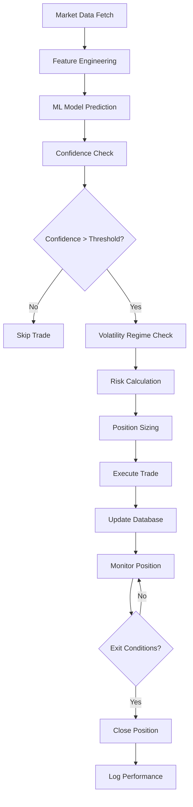

# 🚀 Crypto Trading Bot - Complete Architecture Guide

## Overview

This comprehensive guide details the architecture and implementation of a cryptocurrency trading bot adapted from an existing stock trading system. The bot uses XGBoost for ML predictions, supports multiple exchanges via CCXT, and includes a React dashboard for monitoring.

## 📁 Project Structure

```
crypto-trading-bot/
├── crypto_bot.py                    # Main trading bot implementation
├── manage.py                        # Management and utility scripts
├── requirements.txt                 # Python dependencies
├── .env                            # Environment configuration
├── .env.example                    # Environment template
├── crypto_trades.db                # SQLite database (auto-generated)
├── crypto_xgb_model.json          # Trained XGBoost model (auto-generated)
├── crypto_xgb_model_metadata.json # Model metadata (auto-generated)
├── crypto_bot.log                 # Application logs (auto-generated)
├── backups/                       # Backup directory (auto-generated)
├── frontend/                      # React dashboard
│   ├── src/
│   │   └── CryptoBotDashboard.jsx
│   ├── package.json
│   └── public/
├── docker-compose.yml             # Docker deployment
├── Dockerfile                     # Container configuration
└── README.md                     # Project documentation
```

## 🏗️ Core Architecture Components

### 1. Data Management Layer

**File: `crypto_bot.py` - Class: `CryptoDataFetcher`**

```python
class CryptoDataFetcher:
    """Enhanced data fetcher for cryptocurrency markets"""
    
    def __init__(self, config: CryptoConfig):
        self.config = config
        self.exchange = self._initialize_exchange()
        self.redis_client = redis.Redis(host='localhost', port=6379, db=0, decode_responses=True)
        self.cache_duration = 30  # 30 seconds cache
```

**Key Features:**
- Multi-exchange support via CCXT (Binance, Coinbase, Kraken, etc.)
- Redis caching with 30-second refresh intervals
- Real-time OHLCV data fetching
- Funding rate monitoring for futures
- Order book depth analysis
- Synthetic data generation for API failures
- 24/7 operation (no market hours)

**Methods to Implement:**
- `fetch_ohlcv_data()` - Get candlestick data with caching
- `fetch_funding_rate()` - Get futures funding rates
- `fetch_order_book()` - Get bid/ask depth
- `_generate_synthetic_data()` - Fallback data generation

### 2. Feature Engineering Pipeline

**File: `crypto_bot.py` - Class: `CryptoFeatureEngineering`**

```python
class CryptoFeatureEngineering:
    """Enhanced feature engineering for cryptocurrency markets"""
    
    @staticmethod
    def calculate_technical_indicators(df: pd.DataFrame) -> pd.DataFrame:
        """Calculate comprehensive technical indicators for crypto"""
```

**Technical Indicators (50+ features):**
- Moving averages (SMA 10, 20, 50; EMA 12, 26)
- RSI (14-period and 7-period for crypto speed)
- MACD with signal and histogram
- Bollinger Bands with width and position
- ATR for volatility-based stops
- Volume indicators and ratios
- Momentum and ROC
- Stochastic oscillators
- Williams %R and CCI

**Crypto-Specific Features:**
- Funding rate signals for futures trading
- Order book imbalance indicators
- 24/7 time-based features (hour, day of week)
- High volatility period detection
- Cross-exchange spread analysis

**Target Label Generation:**
```python
@staticmethod
def create_target_labels(df: pd.DataFrame, forward_periods: int = 5,
                       buy_threshold: float = 0.02, sell_threshold: float = -0.015) -> pd.DataFrame:
    """Create three-class target labels for crypto (adapted thresholds)"""
```

### 3. Machine Learning Model

**File: `crypto_bot.py` - Class: `CryptoMLModel`**

**XGBoost Configuration:**
```python
params = {
    'objective': 'multi:softprob',
    'num_class': 3,
    'eval_metric': 'mlogloss',
    'n_estimators': 200,
    'learning_rate': 0.05,
    'max_depth': 6,  # Slightly deeper for crypto complexity
    'subsample': 0.8,
    'colsample_bytree': 0.8,
    'random_state': 42
}
```

**Three-Class Signal System:**
- `0: SELL` - Short position / Close long
- `1: HOLD` - No action / Wait
- `2: BUY` - Long position / Close short

**Key Methods:**
- `train_model()` - Train on historical crypto data
- `predict_signal()` - Get signal with confidence
- `save_model()` / `load_model()` - Model persistence

### 4. Risk Management System

**File: `crypto_bot.py` - Class: `CryptoRiskManager`**

**Volatility-Based Risk Parameters:**
```python
volatility_risk_params = {
    "low": {"sl_atr_mult": 2.0, "tp_atr_mult": 3.0, "min_profit": 0.015},
    "medium": {"sl_atr_mult": 2.5, "tp_atr_mult": 3.5, "min_profit": 0.02},
    "high": {"sl_atr_mult": 3.0, "tp_atr_mult": 4.0, "min_profit": 0.025},
    "extreme": {"sl_atr_mult": 4.0, "tp_atr_mult": 5.0, "min_profit": 0.03}
}
```

**Key Features:**
- Dynamic volatility regime detection
- ATR-based stop loss and take profit calculation
- Confidence-based position sizing
- Flash crash protection for crypto markets
- Trailing stop implementation
- Break-even protection

### 5. Trading Execution Engine

**File: `crypto_bot.py` - Class: `CryptoTradingBot`**

**Core Trading Loop:**
```python
async def run_trading_loop(self):
    """Main trading loop for crypto bot"""
    while True:
        try:
            for symbol in self.config.symbols:
                await self.process_symbol(symbol)
            await asyncio.sleep(60)  # 1 minute interval
        except Exception as e:
            logger.error(f"Error in trading loop: {e}")
            await asyncio.sleep(300)  # 5 minute pause on error
```

**Trade Management:**
- Paper and live trading modes
- Position state persistence
- Real-time P&L calculation
- Exit condition monitoring
- Trade logging to SQLite

### 6. Configuration System

**File: `.env` - Environment Variables**

```bash
# Exchange Configuration
CRYPTO_EXCHANGE=binance
CRYPTO_API_KEY=your_api_key_here
CRYPTO_API_SECRET=your_secret_key_here
CRYPTO_SANDBOX=true

# Trading Parameters
CONFIDENCE_THRESHOLD=0.75
MAX_POSITION_SIZE=0.1
MIN_PROFIT_THRESHOLD=0.02
CRYPTO_SYMBOLS=BTC/USDT,ETH/USDT,BNB/USDT,ADA/USDT,SOL/USDT

# Risk Management
BASE_SL_ATR_MULTIPLIER=3.0
BASE_TP_ATR_MULTIPLIER=4.0

# Crypto-Specific
FUNDING_RATE_THRESHOLD=0.01
WHALE_MOVEMENT_THRESHOLD=1000000
SOCIAL_SENTIMENT_WEIGHT=0.1
```

### 7. API and Dashboard

**File: `crypto_bot.py` - FastAPI Implementation**

**Key Endpoints:**
```python
@app.get("/api/dashboard-data")      # Portfolio overview
@app.get("/api/live-signals/{symbol}") # Real-time signals
@app.get("/api/positions")           # Active positions
@app.post("/api/train-model")        # Trigger training
@app.get("/api/bot-status")          # System status
```

**React Dashboard Features:**
- Real-time portfolio monitoring
- Live signal display with confidence
- Active position tracking
- Equity curve visualization
- Performance metrics by symbol

## 🗄️ Database Schema

**SQLite Tables:**

```sql
-- Trade records
CREATE TABLE trades (
    id TEXT PRIMARY KEY,
    symbol TEXT,
    side TEXT,
    amount REAL,
    price REAL,
    timestamp TEXT,
    signal INTEGER,
    confidence REAL,
    stop_loss REAL,
    take_profit REAL,
    funding_rate REAL,
    fees REAL,
    pnl REAL,
    exit_price REAL,
    exit_timestamp TEXT,
    exit_reason TEXT
);

-- Performance metrics
CREATE TABLE performance_metrics (
    id INTEGER PRIMARY KEY AUTOINCREMENT,
    timestamp TEXT,
    total_trades INTEGER,
    profitable_trades INTEGER,
    total_pnl REAL,
    win_rate REAL,
    sharpe_ratio REAL,
    max_drawdown REAL,
    account_balance REAL
);

-- Model performance tracking
CREATE TABLE model_performance (
    id INTEGER PRIMARY KEY AUTOINCREMENT,
    timestamp TEXT,
    model_version TEXT,
    train_accuracy REAL,
    val_accuracy REAL,
    feature_count INTEGER,
    sample_count INTEGER,
    parameters TEXT
);
```

## 📦 Required Dependencies

**File: `requirements.txt`**

```
ccxt>=4.1.0                 # Cryptocurrency exchange library
pandas>=2.0.0              # Data manipulation
numpy>=1.24.0              # Numerical computing
scikit-learn>=1.3.0        # Machine learning utilities
xgboost>=1.7.0             # Gradient boosting framework
TA-Lib>=0.4.25             # Technical analysis library
redis>=4.5.0               # Redis client for caching
fastapi>=0.100.0           # Modern web framework
uvicorn>=0.22.0            # ASGI server
python-dotenv>=1.0.0       # Environment variable management
aiohttp>=3.8.0             # Async HTTP client
websockets>=11.0.0         # WebSocket client
pydantic>=2.0.0            # Data validation
python-dateutil>=2.8.2     # Date utilities
cryptography>=41.0.0       # Cryptographic functions
```

## 🛠️ Implementation Steps

### Step 1: Create Main Bot File

**File: `crypto_bot.py`**

Create the main trading bot with these classes:
1. `TradingSignal(Enum)` - Signal enumeration
2. `VolatilityRegime(Enum)` - Volatility classification
3. `CryptoConfig` - Configuration dataclass
4. `CryptoTrade` - Trade record dataclass
5. `CryptoDataFetcher` - Data fetching and caching
6. `CryptoFeatureEngineering` - Technical analysis
7. `CryptoRiskManager` - Risk management
8. `CryptoMLModel` - XGBoost model wrapper
9. `CryptoTradingBot` - Main trading engine

### Step 2: Create Management Scripts

**File: `manage.py`**

Create `CryptoBotManager` class with methods:
- `check_requirements()` - Validate dependencies
- `setup_environment()` - Create .env file
- `validate_config()` - Check configuration
- `test_exchange_connection()` - Verify API access
- `initialize_database()` - Setup SQLite tables
- `backup_data()` - Create backups
- `generate_report()` - Performance analytics
- `start_bot()` - Launch trading bot

### Step 3: Create Environment Configuration

**File: `.env.example`**

Template with all configuration options:
- Exchange settings
- Trading parameters
- Risk management
- Crypto-specific features
- Database and logging
- API server settings

### Step 4: Create React Dashboard

**File: `frontend/src/CryptoBotDashboard.jsx`**

Components to implement:
- Portfolio overview with key metrics
- Live signal display with confidence
- Active positions table
- Equity curve chart
- Performance analytics
- Real-time updates via API polling

### Step 5: Setup Deployment

**Files: `Dockerfile`, `docker-compose.yml`**

Container setup with:
- Python 3.11 base image
- TA-Lib installation
- Redis service
- Multi-service orchestration

## 🚀 Trading Logic Flow



## 🔧 Key Crypto Adaptations

### From Stock Bot to Crypto Bot:

1. **Market Hours**: 24/7 operation vs stock market hours
2. **Volatility**: Higher volatility parameters (2-4x ATR vs 3-3.5x)
3. **Data Sources**: CCXT for crypto vs Alpaca for stocks
4. **Features**: Added funding rates, order book, sentiment
5. **Risk Management**: More aggressive stops for crypto volatility
6. **Timeframes**: Added 1m, 5m for high-frequency crypto trading

### Reused Components:
- ✅ XGBoost three-class system
- ✅ SQLite database structure
- ✅ FastAPI backend architecture
- ✅ Redis caching layer
- ✅ Risk management framework
- ✅ Multi-bot coordination patterns

## 📊 Performance Monitoring

### Key Metrics Tracked:
- Total P&L and percentage returns
- Win rate and profit factor
- Sharpe ratio and maximum drawdown
- Trade frequency and average holding time
- Performance by symbol and timeframe
- Model prediction accuracy
- Risk-adjusted returns

### Alerts and Notifications:
- Large position P&L changes
- Model confidence drops
- Exchange connectivity issues
- Risk limit breaches
- Performance degradation

## 🔒 Security Considerations

### API Security:
- Store credentials in environment variables
- Use API key restrictions (trading only)
- Enable IP whitelisting on exchanges
- Rotate API keys regularly

### System Security:
- File permission restrictions (chmod 600 .env)
- Firewall configuration for API access
- Regular backup and recovery testing
- Secure Redis configuration

## 📈 Scaling and Extensions

### Horizontal Scaling:
- Multi-instance deployment with Redis coordination
- Symbol-specific bot instances
- Geographic distribution for latency

### Feature Extensions:
- Social sentiment integration
- On-chain data analysis
- Cross-exchange arbitrage
- DeFi protocol monitoring
- Portfolio optimization algorithms

## 🐛 Troubleshooting Guide

### Common Issues:
1. **TA-Lib Installation**: Platform-specific compilation
2. **Exchange Connectivity**: API key validation
3. **Redis Connection**: Service startup and configuration
4. **Model Training**: Insufficient data or memory
5. **Database Locks**: Multiple instance conflicts

### Monitoring Commands:
```bash
# Check bot status
python manage.py status

# View real-time logs
tail -f crypto_bot.log

# Generate performance report
python manage.py report

# Backup data
python manage.py backup
```

---

## 📝 Implementation Checklist

When implementing this architecture, ensure you:

- [ ] Install all required dependencies including TA-Lib
- [ ] Setup Redis server and verify connectivity
- [ ] Create and configure .env file with valid API credentials
- [ ] Test exchange connection in sandbox mode first
- [ ] Initialize database and verify table creation
- [ ] Train initial model on historical data
- [ ] Start with paper trading to validate logic
- [ ] Monitor logs for errors and performance
- [ ] Setup backup and monitoring procedures
- [ ] Gradually transition to live trading

This architecture provides a robust foundation for cryptocurrency trading while maintaining the proven patterns from your existing stock trading system. The modular design allows for easy extension and customization based on specific trading strategies and risk preferences.