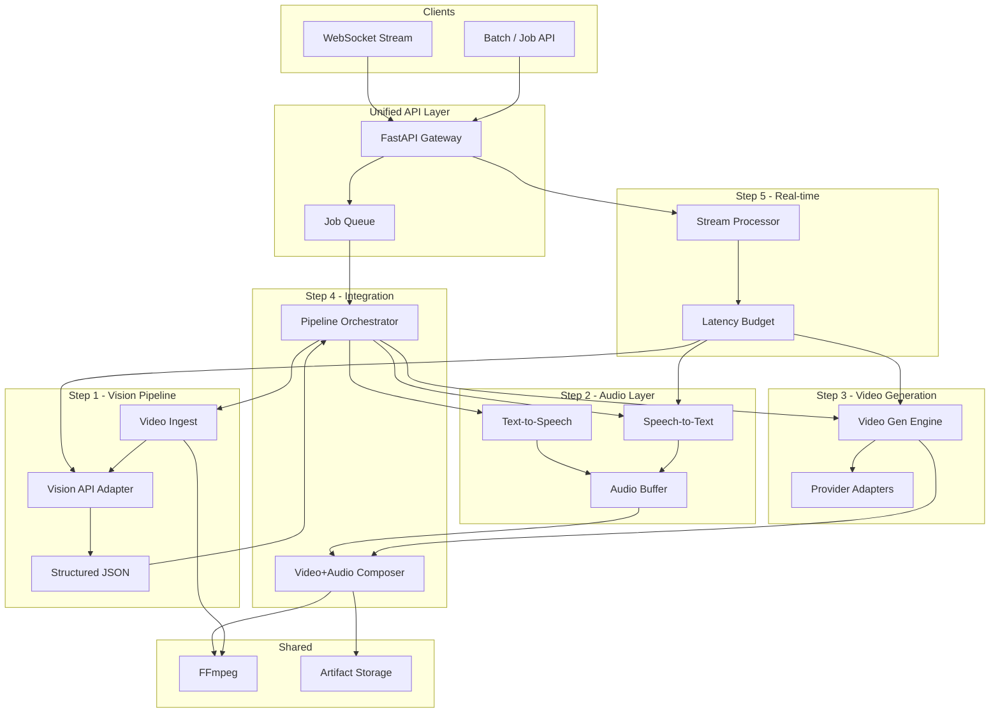
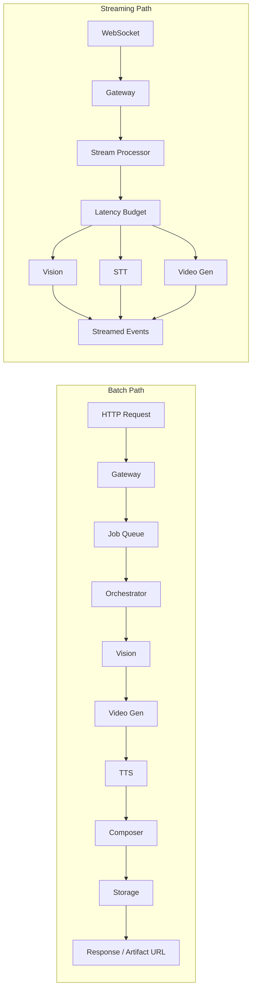

# System Architecture for AI Video Pipeline

This architecture follows the [DEVELOPMENT_PLAN.md](../DEVELOPMENT_PLAN.md) five-step plan and the stated tech choices (Python, FastAPI/Flask, WebSockets, FFmpeg). It is designed so each step can be built and tested independently, then composed into a single pipeline and later optimized for real-time.

---

## High-Level Architecture

---

## Runtime View: Batch vs Streaming Paths

- **Batch path:** Request enters via REST; Gateway enqueues a job; Orchestrator runs the full pipeline (Vision → Video Gen → TTS → Composer) and writes the result to Storage; client receives artifact ID/URL (or polls for completion).
- **Streaming path:** Client connects via WebSocket; Gateway hands off to Stream Processor; each stage (Vision, STT, Video Gen) runs under a latency budget and pushes events (e.g. object labels, transcript segments, generated clips) back over the socket.

---

## 1. Component Map to Development Plan

| Plan step | Architecture component | Responsibility |
|-----------|------------------------|----------------|
| **Step 1** | **Vision Processing Pipeline** | Ingest video (FFmpeg), call Vision API (Google Vision / Roboflow / GPT-4o), return structured JSON (object labels with timestamps, scene descriptions, key frames). |
| **Step 2** | **Audio Intelligence Layer** | STT (Deepgram/Chirp/Soniox) and TTS (Cartesia/ElevenLabs/Google TTS); buffer and expose transcription + synthesized audio for pipeline. |
| **Step 3** | **Video Generation Engine** | Adapters for LTX, Kling (and mock); support text-to-video, image-to-video, video extension; output 720p+ segments. |
| **Step 4** | **Component Integration** | Orchestrator + unified API: input video → vision description → generated video → TTS voiceover → composed video+audio. |
| **Step 5** | **Real-time Streaming** | WebSocket path: live feed → vision/STT/video gen with strict latency budget (<500 ms target); optional frame dropping and quality trade-offs. |

---

## 2. Project Layout

Single repository, one application (modular monolith) to match “unified API” and “fastest prototyping”:

| Package | Description |
|---------|-------------|
| **app/** | FastAPI app, routing, middleware. |
| **core/** | Config, logging, latency budgets, shared types. |
| **vision/** | Step 1: ingest, key-frame extraction (FFmpeg), Vision API client, JSON schema for objects/scenes/timestamps. |
| **audio/** | Step 2: STT client(s), TTS client(s), audio buffers, WER/metrics hooks. |
| **video_gen/** | Step 3: provider adapters (LTX, Kling, mock), text/image/video extension modes. |
| **orchestration/** | Step 4: pipeline DAG (vision → video gen → TTS → compose), job state, artifact references. |
| **streaming/** | Step 5: WebSocket handlers, chunked processing, latency checks. |
| **media/** | FFmpeg wrappers (decode, encode, mux video+audio), temp file handling. |
| **storage/** | Save/retrieve inputs and outputs (e.g. local disk or cloud object store). |

Config and secrets: env-based (e.g. per-API keys); no keys in repo.

---

## 3. Data Flow

### 3.1 Integrated Pipeline (Step 4 End-to-End)

1. **Input:** Video file or URL → Gateway accepts upload or reference.
2. **Vision:** Video → FFmpeg (segment/keyframes) → Vision API → structured JSON (objects, scenes, timestamps).
3. **Video gen:** Scene description (and optional source frames) → Video Gen Engine → one or more 720p+ clips.
4. **Audio:** Optional script or vision-derived script → TTS → audio segments.
5. **Compose:** FFmpeg mux video + audio → final asset → Storage; return artifact ID/URL.

All steps are async-friendly (e.g. `async` HTTP clients, optional background job queue for long runs).

### 3.2 Real-time Path (Step 5)

1. **Input:** WebSocket connection; client sends chunks (video frames and/or audio).
2. **Dispatch:** Stream Processor assigns chunks to Vision, STT, and/or Video Gen according to request and latency budget.
3. **Vision:** Frames → downscaled/sampled if needed → Vision API → object/scene events pushed on socket (<300 ms target).
4. **STT:** Audio chunks → streaming STT API → partial/final transcript events pushed on socket.
5. **Video gen (optional):** Triggers (e.g. on scene change) → fast provider or skip-on-timeout → generated segment events or URLs pushed on socket.
6. **Backpressure:** If latency budget is exceeded, drop or reduce quality (e.g. skip frames, lower resolution) and report drop counts for metrics.

---

## 4. API Surface

- **REST (batch):**
  - `POST /v1/vision` – video in → vision JSON (Step 1 test).
  - `POST /v1/audio/transcribe`, `POST /v1/audio/synthesize` – Step 2 test.
  - `POST /v1/video/generate` – text/image/video extension (Step 3 test).
  - `POST /v1/pipeline/run` – full pipeline (Step 4 test).
- **WebSocket (Step 5):**
  - `WS /v1/stream` – send chunks (video/audio), receive vision events, transcript, and/or generated segments; enforce <500 ms where applicable.

---

## 5. Latency and Scaling Considerations

### Latency

- **Latency budget:** <300 ms for object detection in real-time mode; <500 ms end-to-end for live scenarios; configurable in `core/`.
- **Tactics:** Streaming STT, reduced frame rate or resolution for vision, “fast” video gen provider or skip-on-timeout; WebSocket backpressure to avoid dropped frames.
- **Metrics:** Per-stage latency and drop counts to validate success criteria (e.g. dashboards, logs).

### Scaling

- **Horizontal:** Stateless Gateway and Stream Processor; scale app instances behind a load balancer; job queue (e.g. Redis/Celery or in-process async queue) allows multiple workers for batch jobs.
- **Queue depth:** Limit queue size and reject or throttle when full to avoid unbounded latency.
- **Storage:** Use shared or cloud object storage for artifacts so any instance can serve results; temp files on local disk should be short-lived and cleaned after upload.
- **External APIs:** Respect provider rate limits; use connection pooling and async clients to maximize throughput per instance.

---

## 6. Development Plan Step → Success Metric Mapping

| Step | Goal | Success Metric |
|------|------|----------------|
| **Step 1** | Input video → Extract visual understanding | API returns structured JSON with detected objects/scenes (object labels with timestamps, scene descriptions, key frame extractions). |
| **Step 2** | Extract speech → Generate speech | Transcription WER < 10%; TTS output sounds human-like. |
| **Step 3** | Text/image prompts → Generated video | All three modes (text-to-video, image-to-video, video extension) render successfully at 720p+ and maintain visual coherence. |
| **Step 4** | Connect all 3 systems through a unified API | End-to-end pipeline runs without manual intervention; output is combined video+audio. |
| **Step 5** | Handle live/streaming with acceptable latency | System maintains <500 ms end-to-end latency; no dropped frames (or metrics to track and bound drops). |

Implementation should follow this document and the development plan’s testable steps in order (Steps 1–5).
